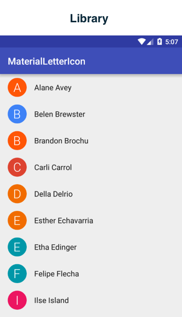
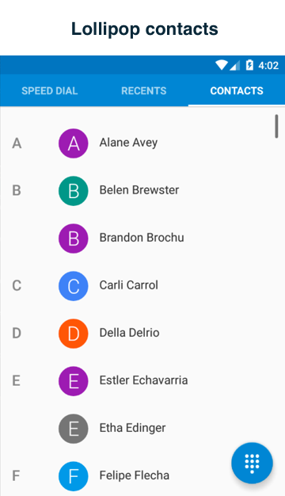
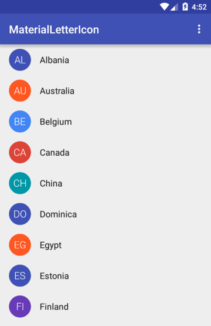
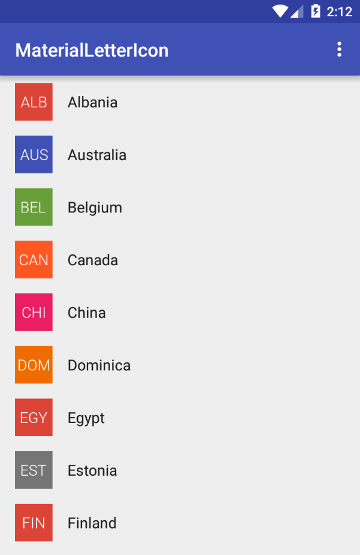
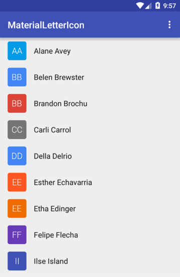
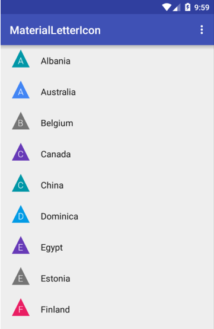

# React Native: react-native-material-letter-icon

[](https://github.com/gaetanozappi/react-native-material-letter-icon)
[](https://www.npmjs.com/package/react-native-material-letter-icon)

[](https://github.com/gaetanozappi/react-native-material-letter-icon)
[](https://www.npmjs.com/package/react-native-material-letter-icon)

[](https://github.com/gaetanozappi/react-native-material-letter-icon/issues)
[](https://github.com/gaetanozappi/react-native-material-letter-icon/issues?q=is%3Aissue+is%3Aclosed)
[](http://github.com/gaetanozappi/react-native-material-letter-icon/issues)
[]()




Variations
----------





-   [Usage](#-usage)
-   [License](#-license)

## 📖 Getting started

`$ npm install react-native-material-letter-icon --save`

`$ react-native link react-native-material-letter-icon`

#### Android

1. Open up `android/app/src/main/java/[...]/MainActivity.java`
  - Add `import com.zappi.ui.material.letter.icon.RNMaterialLetterIconPackage;` to the imports at the top of the file
  - Add `new RNMaterialLetterIconPackage()` to the list returned by the `getPackages()` method
2. Append the following lines to `android/settings.gradle`:
  	```
  	include ':react-native-material-letter-icon'
  	project(':react-native-material-letter-icon').projectDir = new File(rootProject.projectDir, 	'../node_modules/react-native-material-letter-icon/android')
  	```
3. Insert the following lines inside the dependencies block in `android/app/build.gradle`:
  	```
      compile project(':react-native-material-letter-icon')
  	```

## 💻 Usage
```javascript
import React, { Component } from 'react';
import {
  Platform,
  StyleSheet,
  Text,
  View
} from 'react-native';
import RNMaterialLetterIcon from 'react-native-material-letter-icon';

type Props = {};
export default class App extends Component<Props> {
  render() {
    return (
      <View style={styles.container}>
      <RNMaterialLetterIcon
      size={80}
      border={true}
      borderColor={"#dd2c00"}
      borderSize={2}
      />
      <RNMaterialLetterIcon
      size={80}
      shapeColor={"#ff5722"}
      shapeType={"round"}
      />
      <RNMaterialLetterIcon
      size={80}
      shapeColor={"#4caf50"}
      shapeType={"triangle"}
      />
      <RNMaterialLetterIcon
      size={80}
      shapeColor={"#303f9f"}
      shapeType={"rect"}
      />
      </View>
    );
  }
}

const styles = StyleSheet.create({
  container: {
    flex: 1,
    justifyContent: 'center',
    alignItems: 'center',
    backgroundColor: '#F5FCFF',
  }
});

```

## 💡 Props

| Prop              | Type       | Default | Note                                                                                                       |
| ----------------- | ---------- | ------- | ---------------------------------------------------------------------------------------------------------- |
| `shapeColor`      | `string`   | `#1e95cc`  | Shape color resource
| `shapeType`       | `string`   | `circle`   | Shape type (circle,rectangle,rect,round)
| `letter`          | `string`   |`Leonardo Wilhelm DiCaprio`      | Letter, string or initials to get letters from
| `letterColor`     | `string`   | `#ffffff`  | Letter color
| `letterSize`      | `number`   | `26`       | Letter size
| `lettersNumber`   | `number`   |            | Letter number
| `initials`        | `bool`     | `true`     | Initials enabled
| `initialsNumber`  | `number`   | `3`        | Initials number
| `border`          | `bool`     |            | Border enabled
| `borderColor`     | `string`   |            | Border color
| `borderSize`      | `string`   |            | Border size

## ✨ Credits
- Android Material Letter Icon: [IvBaranov/MaterialLetterIcon](https://github.com/IvBaranov/MaterialLetterIcon)

## 💫 Contribute
- Pranav Raj Singh Chauhan: [prscx](https://github.com/prscx)

## 📜 License
This library is provided under the Apache License.
